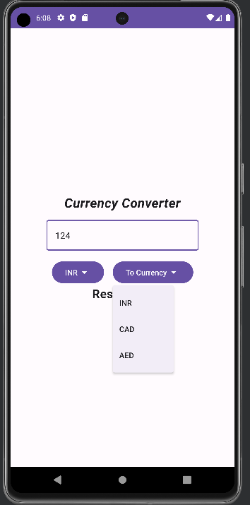

# Currency Converter Application

## About

A simple Android application for converting between difference currencies. Developed using Kotlin
and Jetpack Compose for UI. 

## Features

The android app lets you:
* Convert between different currencies based on standard exchange rates.
* Select currency type (from and to) through easy-to-use drop down boxes.
* Displays converted currencies in text box.
* Easy to use and provides a simple single screen interface.
* Dynamic currency conversion based on changes to input text.

Shown below are snapshots of the user-interface of the application:

| Entry Screen                           | Select Currency                              | Result                                  |
|----------------------------------------|----------------------------------------------|-----------------------------------------|
|  |  |  |